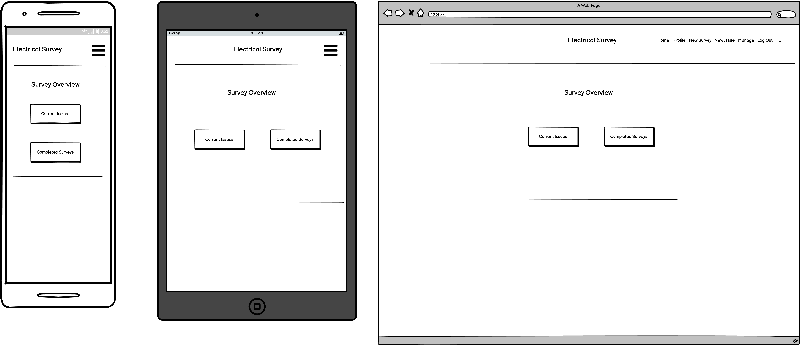
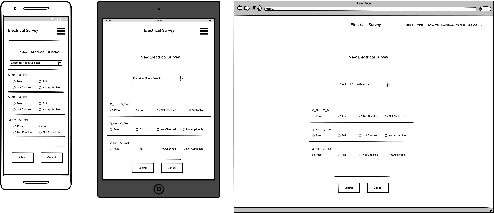
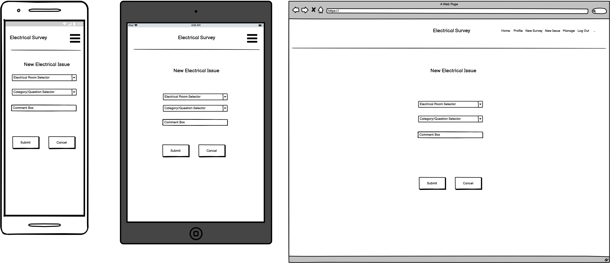

# Electrical Survey DB : Switchroom Safety Database

* A data-driven web application for tracking electrical safety issues across your site(s).

## Contents

---

* UX
  * Project Goals
    * User Goals
    * User Stories
    * Site Owner Goals
    * User Requirements and Expectations
    * Design Choices
      * Fonts
        * Icons
        * Colours
* Technologies
* Features
  * Features that have been developed
    * Features that will be implemented in the future
* Testing
* Bugs
* Deployment
* Credits

## UX (User Experience)

---

### Project Goals

* The goal of this project is to create a simple to use data-driven site to track electrical safety issues.

### User Goals

* User registration available to sign up as a site-user.
* View and add electrical rooms to the survey.
* View, add, modify and delete survey reports from the site.
* View, add, modify and delete individual issue notifications.
* Get an overview of the status of all the surveyed rooms.

### User Stories

#### Viewing and Navigation

* 1.   As a **Site User**, I want to be able to **simply navigate around the site** so that I can **perform surveying tasks without needing to learn a new tool**.
* 2.   As a **Site User**, I want to be able to **use the site on a mobile device** so that I can **perform surveying tasks in the field.**.
* 3.   As a **Site User**, I want to be able to **see a list of electical rooms on the site** so that I can **understand the scope of the plant's electrical infrastructure**.
* 4.   As a **Site User**, I want to be able to **see a list of completed survey reports** so that I can **review previous work done**.
* 5.   As a **Site User**, I want to be able to **see a list of open electrical issues** so that I can **see if there are any urgent issues which need attention**.

#### Registration and User Accounts

* 6.   As a **Site User**, I want to be able to **easily sign up for an account** so that I can **have an account and view my profile**.
* 7.   As a **Site User**, I want to be able to **Log in** so that I can **access my personal information**.
* 8.   As a **Site User**, I want to be able to **Logout** so that I can **securely leave the site**.

#### Surveying

* 9.   As a **Surveyor**, I want to be able to **create a new electrical survey report** so that I can **record any defects present in a particular room**.
* 10.   As a **Surveyor**, I want to be able to **create a new electrical issue** so that I can **record a single, higher priority defect**.
* 11.   As a **Surveyor**, I want to be able to **edit a previously submitted report** so that I can **update or modify a submitted report with newer or more accurate information**.
* 12.   As a **Surveyor**, I want to be able to **delete a previously submitted report** so that I can **remove a report that has been submitted in error**.
* 13.   As a **Shopper**, I want to be able to **edit a previously submitted issue** so that I can **update or modify a submitted issue with newer information**.
* 14.   As a **Shopper**, I want to be able to **delete a previously submitted issue** so that I can **remove an issue that has been submitted in error**.

#### Site Administration

* 15.   As a **Site-Owner**, I want to be able to **see a list of users** so that I can **easily see the list of current users**.

### User Requirements and Expectations

#### Requirements

* Simple, responsive, data-driven site.
* Fast loading times are imperative.
* No frills, high-contrast layout for maximum legibity since this site will primarily be used on mobile devices in the field.
* Intuitive navigation and site operation with flash messages for good UX.

#### Expectations

* Content is visually minimalist and clear to look at.
* The design is responsive and will work across a wide variety of screen sizes.
* No frills to ensure fast loading times.

### Design Choices

---

In terms of design, the standard materialize fonts and color schemes were used for the sake of simplicity. An amber-yellow color scheme was chosen to reflect the relevance of this site to safety with these colors being synonymous with ISO7010 warning signage.

#### Fonts

* [Materialize Typography](https://materializecss.com/typography.html) has been used throughout the site. With legibilty and ease of eye strain being a key focus for site users, the standard Materialize fonts are excellent.

#### Icons

* [FontAwesome](https://fontawesome.com/) free icons were used throughout this project.

#### Colors

The website colors were chosen using [Materialize Colors](https://materializecss.com/color.html).

## Wireframing

  
Wireframing was done using Balsamiq under full-functional trial provided by Code Institute. Wireframes were only created for the more complicated screens. Smaller screens were created organically. 

### Project Wireframes

* Main Landind Screen

* Add a Room Screen

* Add a new survey report screen

* Add a new issue screen

---

## Features

---
**Features** that have been **implemented:**

* User authentication with log in and logout functions available.
* User profile page with username, First Name, Surname and Company name available.
* List of DB rooms is available with each of the details available in collapsible elements.
* Only create and view functionality is possible for rooms at the moment.
* Create, view, update and delete an electrical survey report.
* Create, view, update and delete an electrical issue report.
* List all survey questions.

**Features** that will be **implemented** in the **future:**

* Add a new survey question.
* Display and list survey questions by category.
* Give numerical overview of the survey results on the front page.
* Create, update and delete possible to survey questions.
* Overview of status of electrical rooms with pass/fail point numbers.
* List of users on the site with edit and delete possible for admin users.
* Possibility to mark items as completed.
* Add links to photos for each item.

## Technologies Used

---

### Languages

* HTML
* CSS
* JavaScript
* Python

### Tools & Libraries

* [Git](https://git-scm.com/)
* [Bootstrap](https://getbootstrap.com/)
* [Popper](https://popper.js.org/)
* [JQuery](https://jquery.com/)
* [Google fonts](https://fonts.google.com/)
* [Markdownlint](https://dlaa.me/markdownlint/)
* [W3C HTML Validator](https://validator.w3.org/)
* [W3C CSS Validator](https://jigsaw.w3.org/css-validator/validator)
* [JSHint](https://jshint.com/)
* [MongoDB](https://www.mongodb.com/)
* [Heroku](https://www.heroku.com/)
* [Jinja Templating for Python](https://jinja.palletsprojects.com/en/3.0.x/)
* [Random Key Generator](https://randomkeygen.com/)

## Testing

---

### HTML Test

HTML code has been tested using the [HTML Validator](https://validator.w3.org/) and gave the following error:

#### HTML Test Errors

* All errors related to illegal characters because of Jinja templating used.

#### HTML Test Fixes

* N/A

### CSS Test

CSS code has been tested using the [CSS validator](http://jigsaw.w3.org/css-validator/) and gave the following errors and warnings.

#### CSS Test Errors

* 129		Value Error : margin-left Too many values or values are not recognized : 4 40px
* 167		Value Error : padding-left Too many values or values are not recognized : 4 40px.

#### CSS Test Warnings

* N/A

#### CSS Test Fixes

* N/A

### JavaScript Test

#### JavaScript Test Errors

* No errors.

#### JavaScript Test Warnings

* N/A

#### JavaScript Test Fixes

* N/A

### Python Test

#### Python Test Errors

* Python errors were fixed using Gitpods built in linter to reduce error down to the single remaining error relating to env.py.
* Most python issues were minor and relating to PEP8 compliance.

#### Python Test Warnings

* N/A

#### Python Test Fixes

* N/A

### Responsiveness

  
Responsiveness of the design was tested throughout the development using Google Chrome's Developer Tools. Screenshots are shown below for the new survey screen which is the most content intesive of the project.

#### Summary of responsive design tests

* Moto G5 - Acceptable (**PASS**)

* Galaxy S5 - Acceptable (**PASS**)

* Pixel 2 - Acceptable (**PASS**)

* Pixel 2 XL - Acceptable (**PASS**)

* iPhone 5 - Acceptable (**PASS**)

* iPhone 6/7/8 - Acceptable (**PASS**)

* iPhone X - Acceptable (**PASS**)

* iPad - Acceptable (**PASS**)

* iPad Pro - Acceptable (**PASS**)

* Surface Duo - Acceptable (**PASS**)

* Galaxy Fold - Worst performing device in tests because of very narrow screen. Elements are still clickable if a bit squished. Acceptable but probably not an ideal device for use as a surveying platform. (**PASS**)

* Nest Hub - Acceptable (**PASS**)

* Nest Hub Max - Acceptable (**PASS**)

### Design

* The idea for doing this project came from an Excel sheet that I had developed as part of my dayjob as an electrical engineer. I work in a very large industrial plant with over 80 electrical switchrooms so I developed a survey system to check for electrical issues across the site. A hard-copy survey sheet is filled out on paper and manually typed into Excel at the end of the survey run. The system works very well but is hugely labourious. The goal of this project is to use state-of-the-art web technology to make this a seamless process.

### User Stories

  
User stories were tested using Google Chrome and developer tools.

#### Summary of user tests

##### Viewing and Navigation

* Test-1.   As a **Site User**, I want to be able to **simply navigate around the site** so that I can **perform surveying tasks without needing to learn a new tool**.

* Test-2.   As a **Site User**, I want to be able to **use the site on a mobile device** so that I can **perform surveying tasks in the field.**.

* Test-3.   As a **Site User**, I want to be able to **see a list of electical rooms on the site** so that I can **understand the scope of the plant's electrical infrastructure**.

* Test-4.   As a **Site User**, I want to be able to **see a list of completed survey reports** so that I can **review previous work done**.

* Test-5.   As a **Site User**, I want to be able to **see a list of open electrical issues** so that I can **see if there are any urgent issues which need attention**.

##### Registration and User Accounts

* Test-6.   As a **Site User**, I want to be able to **easily sign up for an account** so that I can **have an account and view my profile**.

* Test-7.   As a **Site User**, I want to be able to **Log in** so that I can **access my personal information**.

* Test-8.   As a **Site User**, I want to be able to **Logout** so that I can **securely leave the site**.

##### Surveying

* Test-9.   As a **Surveyor**, I want to be able to **create a new electrical survey report** so that I can **record any defects present in a particular room**.

* Test-10.   As a **Surveyor**, I want to be able to **create a new electrical issue** so that I can **record a single, higher priority defect**.

* Test-11.   As a **Surveyor**, I want to be able to **edit a previously submitted report** so that I can **update or modify a submitted report with newer or more accurate information**.

* Test-12.   As a **Surveyor**, I want to be able to **delete a previously submitted report** so that I can **remove a report that has been submitted in error**.

* Test-13.   As a **Shopper**, I want to be able to **edit a previously submitted issue** so that I can **update or modify a submitted issue with newer information**.

* Test-14.   As a **Shopper**, I want to be able to **delete a previously submitted issue** so that I can **remove an issue that has been submitted in error**.

##### Site Administration

* Test-15.   As a **Site-Owner**, I want to be able to **see a list of users** so that I can **easily see the list of current users**.

## Bugs

---

Many bugs were encountered during the development of the project - all admittedly of my own making.

### Development Bugs

* Bug 1
* Bug 2
* Bug 3
* Bug 4
* Bug 5

### Testing Bugs

* A few bugs were thrown up during development and generally centered around getting .

## Deployment

---

The site has been deployed on [Heroku](https://www.heroku.com/) with under the following link [electrical-survey-db](http://electrical-survey-db.herokuapp.com/).

## Credits

---

* [JSHint.com](https://jshint.com/) was used to error check the JavaScript code.
* [Markdown guide basic syntax](https://www.markdownguide.org/basic-syntax/) was used as a reference in writing the README.md file.
* [Markdownlint](https://dlaa.me/markdownlint/) by [David Anson](https://github.com/DavidAnson) was used for correcting the errors in my markdown. It is an awesome resource and saved me hours of correction time.
* Code for box shadow on headers generated by [cssgenerator.org](https://cssgenerator.org/box-shadow-css-generator.html).

### Special Thanks

* My Code Institute mentor, [Simen Daehlin](https://github.com/Eventyret). 
* [Tim Nelson](https://github.com/TravelTimN) for his superb walk-through project on which this site is based. Without his tutorial videos, I would never have got Heroku, Github, Gitpod, Python, Jinja and Mongo all working together.

